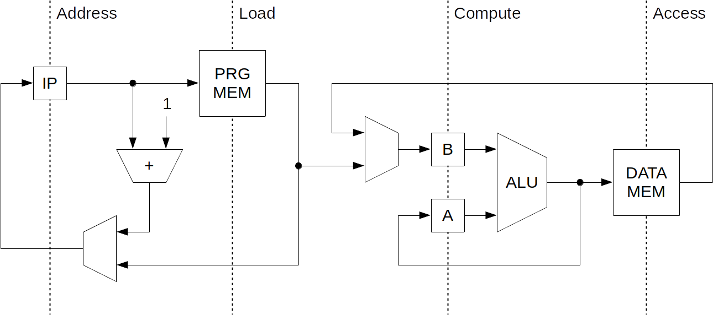

**This repository is going to be [remastered](https://github.com/users/dominiksalvet/projects/2#card-26446302) sometime in the future.**

---

# Six Beta Processor

Six Beta is the successor of the Six Alpha 4-bit processor. It brings pipelining and programming interface compared to the Six Alpha.

## License

This project is licensed under an Open Source Initiative approved license, the MIT License. See the [*LICENSE.txt*](LICENSE.txt) file for details. Individual files contain the SPDX license identifier instead of the full license text.

  

